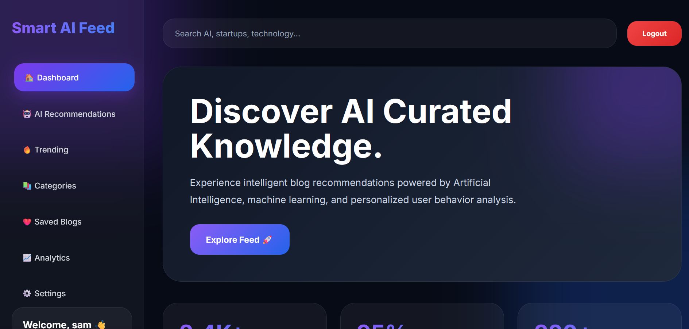

# 🚀 Smart AI Feed Recommendation System

An AI-powered blog recommendation web application built using **FastAPI, Python, HTML, CSS, and JavaScript**.
The platform provides users with intelligent blog recommendations, trending articles, category-based browsing, and interactive blog features.

---

# ✨ Features

* 🔐 User Authentication (Login / Signup)
* 🤖 AI Blog Recommendations
* 🔍 Search Blogs Functionality
* 🔥 Trending Blogs Section
* 📚 Dynamic Categories
* ❤️ Save Blogs Feature
* 👍 Like Blogs Feature
* 📈 Analytics Section
* ⚙️ Settings Panel
* 🎨 Modern Glassmorphism UI
* 📱 Responsive Dashboard Design
* ⚡ FastAPI Backend APIs
* 📂 CSV Dataset Integration

---

# 🛠️ Technologies Used

## Frontend

* HTML5
* CSS3
* JavaScript

## Backend

* Python
* FastAPI
* Uvicorn

## Database / Dataset

* CSV Dataset (`articles_dataset.csv`)
* SQLite (`smart_ai_feed.db`)

## Tools & Libraries

* Pandas
* VS Code / PyCharm
* GitHub

---

# 🔎 Example Queries

Users can search blogs using queries like:

```text
AI
Technology
Machine Learning
Startups
Python
Future of AI
Data Science
```

---

# 📸 Project Screenshots

## 🔐 Login Page


---

## 🏠 Home Dashboard



---

## 📰 Blog Recommendation Feed


---

# 📁 Project Structure

```text
recommandation/
│
├── backend/
│   ├── routes/
│   ├── models/
│   ├── services/
│   ├── database.py
│   └── main.py
│
├── frontend/
│   ├── login.html
│   ├── signup.html
│   ├── home.html
│   ├── feed.html
│   ├── auth.js
│   ├── feed.js
│   ├── style.css
│   └── auth.css
│
├── articles_dataset.csv
├── smart_ai_feed.db
├── import_dataset.py
└── README.md
```

---

# ⚙️ Project Workflow

## Step 1 — User Authentication

* User signs up or logs in.
* Credentials are validated using FastAPI backend APIs.

## Step 2 — Dashboard Loading

* After login, user is redirected to the Home Dashboard.

## Step 3 — Fetch Blogs

* Frontend requests blog data from backend APIs.

## Step 4 — Display Feed

* Blogs are dynamically rendered using JavaScript.

## Step 5 — User Interaction

Users can:

* Search blogs
* View trending blogs
* Explore categories
* Like blogs
* Save blogs
* Get recommendations

---

# 🌐 Backend APIs

## Home API

```python
@app.get("/")
def home():
    return {"message": "Smart AI Feed Backend Running Successfully 🚀"}
```

---

## All Blogs API

```python
@app.get("/all-blogs")
def get_all_blogs():
    blogs = df.to_dict(orient="records")
    return blogs
```

---

## Categories API

```python
@app.get("/categories")
def get_categories():
    categories = df["Category"].dropna().unique().tolist()
    return {"categories": categories}
```

---

# 🧠 AI Recommendation Concept

The project uses:

* Dataset-driven recommendations
* Category-based filtering
* Search matching
* Dynamic blog rendering

This creates an AI-style personalized feed experience.

---

# 🚀 Future Improvements

* 🧠 Real Machine Learning Recommendation Model
* 🔐 JWT Authentication
* ☁️ Cloud Deployment
* 💬 Blog Comments System
* 👤 User Profiles
* 📊 Advanced Analytics
* 🌙 Dark / Light Mode
* 📝 Admin Dashboard
* 🔔 Notifications
* 📱 Mobile App Version

---

# 📌 Advantages

* Beginner-friendly AI project
* Modern UI/UX
* Fast backend performance
* Easy API integration
* Scalable architecture
* Real-world recommendation system concept

---

# ▶️ Run the Project

## Backend

```bash
uvicorn backend.main:app --reload
```

---

## Frontend

Open:

```text
frontend/login.html
```

using Live Server or browser.

---

# 👨‍💻 Developed By

### Smart AI Feed Recommendation System

Built using:

* FastAPI
* Python
* HTML
* CSS
* JavaScript

---

# ⭐ Conclusion

Smart AI Feed is a complete AI-based recommendation platform that combines:

* frontend development,
* backend API integration,
* dataset processing,
* and modern UI design.

The project demonstrates practical implementation of recommendation systems and web development concepts in a real-world style application.
